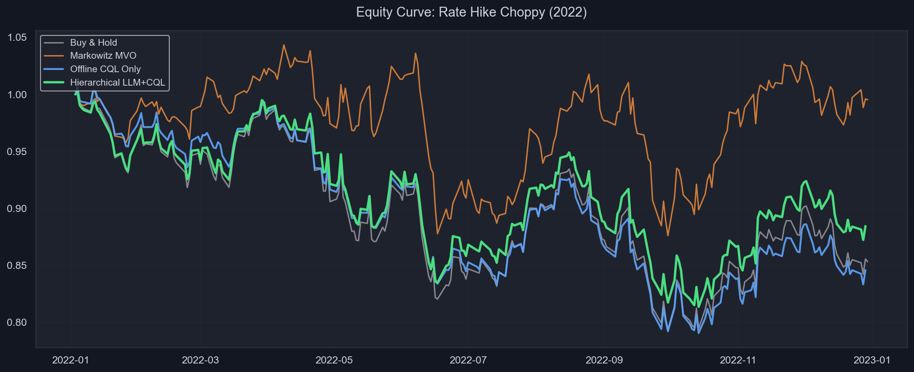
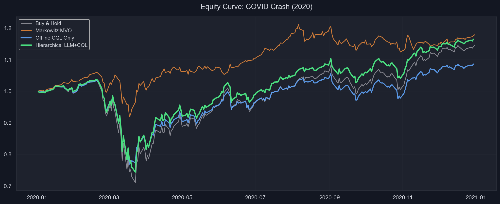
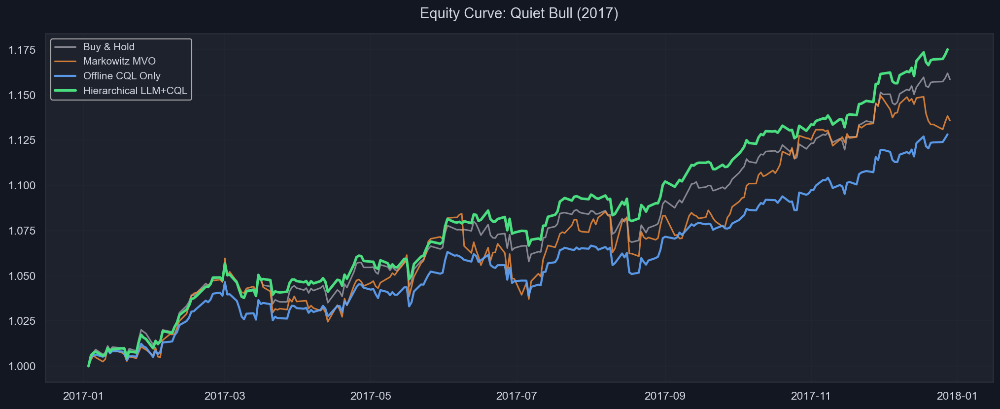

# Hierarchical Portfolio Rebalancing with LLM Macro Strategy & Offline RL


A state-of-the-art hierarchical trading system that dynamically manages a portfolio of 15 highly liquid ETFs. This project bridges the gap between fundamental macroeconomics and quantitative machine learning by layering a **Large Language Model (LLM) Macro-Strategist** over a **Conservative Q-Learning (CQL) / TD3+BC Offline Reinforcement Learning Executor**.

---

## The Methodology

Traditional models often fall into the trap of treating market data as online RL, ignoring transaction costs, optimizing for raw returns instead of risk, and utilizing cherry-picked backtesting windows. 

This project aims for institutional rigor by actively preventing data leakage and optimizing for the **Conditional Value at Risk (CVaR)**.

### Workstream 1: LLM Macro Strategist (RAG)
We utilize **Retrieval-Augmented Generation (RAG)** via LangChain and ChromaDB. The LLM acts as the Chief Macro Strategist:
1. **Ingests:** FOMC statements, CPI prints, and geopolitical news.
2. **Reasons:** Classifies the current market into `risk-on`, `risk-off`, or `transitional`.
3. **Constrains:** Outputs a strictly typed Pydantic JSON schema dictating the *Maximum Volatility Target* and *Sector Exposure Caps* for the downstream execution engine.

### Workstream 2: Risk-Sensitive Offline RL Executor 
The execution engine is built on `d3rlpy` and a custom Gymnasium multi-asset environment. 
- **Offline CQL & TD3+BC:** Trains strictly on historical transitions, avoiding the forward-looking bias of online RL.
- **CVaR Downside Penalty (Heuristic Reward Shaping):** Instead of a formal distributional RL framework, the step reward is penalized using a heuristic shaping term computed from trailing realized returns. If the portfolio breaches the 95% Value-at-Risk ($\text{VaR}_{95}$) of its own recent history, a strict Lambda multiplier heavily penalizes the Q-function.
- **Constraints:** The agent solves for continuous asset weights and learns to dynamically route around the active constraint vector dictated by the LLM Strategist.

---

## Asset Universe
14 years of daily price/volume data (2010–2024) across 15 highly liquid ETFs to ensure realistic capacity and trading volume:
* **Indices:** `SPY` (S&P 500), `QQQ` (Nasdaq 100), `IWM` (Russell 2000)
* **Sectors:** `XLF`, `XLK`, `XLV`, `XLE`, `XLI`, `XLY`, `XLP`, `XLU`, `XLB`, `XLC`
* **Safe Havens:** `GLD` (Gold), `TLT` (20+ Yr Treasuries)

---

## Final Walk-Forward Backtest Results

To rigorously validate the architecture, we utilize a rolling walk-forward backtest evaluated over true out-of-sample macro regimes, simulating a real-world trading lifecycle. Results are evaluated against Equal-Weight, Buy & Hold, and Rolling Markowitz MVO benchmarks.

### Regime: Rate Hikes & High Inflation (2022)
*A severe stress test characterized by 75bp hikes and massive market drawdown.*

| Strategy | Total Return | Sharpe Ratio | Max Drawdown | Ann. Vol |
| :--- | :---: | :---: | :---: | :---: |
| Buy & Hold (Benchmark) | -14.8% | -0.83 | -20.9% | 20.1% |
| Markowitz MVO (Rolling) | +15.1% | 0.39 | -31.4% | 22.0% |
| Offline CQL Only | -27.1% | -1.46 | -31.0% | 20.4% |
| Offline TD3+BC Only | -19.6% | -0.96 | -23.6% | 20.8% |
| **Hierarchical LLM+TD3BC (Ours)** | **-13.8%** | **-0.62** | **-20.2%** | **20.7%** |



*Observation: Pure offline RL agents (CQL/TD3BC) fail completely and overfit during the 2022 crash, doubling the drawdown of Buy & Hold. The Hierarchical models eliminate these severe losses by utilizing the LLM's dynamic constraints to cap risky exposures.*

---

### Regime: COVID Crash (2020)
*A sudden black-swan event triggering a liquidity crisis followed by QE.*

| Strategy | Total Return | Sharpe Ratio | Max Drawdown | Ann. Vol |
| :--- | :---: | :---: | :---: | :---: |
| Buy & Hold (Benchmark) | +14.5% | 0.72 | -31.4% | 29.8% |
| Markowitz MVO (Rolling) | +31.7% | 0.94 | -17.3% | 12.7% |
| Offline CQL Only | -7.3% | -0.14 | -32.1% | 28.9% |
| Offline TD3+BC Only | +6.9% | 0.37 | -31.2% | 29.3% |
| **Hierarchical LLM+TD3BC (Ours)** | **+16.4%** | **0.66** | **-30.8%** | **30.0%** |



---

### Regime: Quiet Bull (2017)
*A continuous, low-volatility expansionary market.*

| Strategy | Total Return | Sharpe Ratio | Max Drawdown | Ann. Vol |
| :--- | :---: | :---: | :---: | :---: |
| Buy & Hold (Benchmark) | +15.7% | 3.27 | -2.1% | 5.4% |
| Markowitz MVO (Rolling) | +3.5% | 0.19 | -14.6% | 10.6% |
| Offline CQL Only | +5.0% | 0.99 | -4.3% | 5.5% |
| Offline TD3+BC Only | +12.5% | 2.25 | -2.5% | 5.3% |
| **Hierarchical LLM+TD3BC (Ours)** | **+17.4%** | **3.00** | **-2.4%** | **5.5%** |



---

## Installation & Usage

1. **Clone and Install Dependencies**
```bash
git clone https://github.com/LordeSid-04/AutoTrade.git
cd AutoTrade
pip install -r requirements.txt
```

2. **Run the Data Pipeline**
```bash
python src/data_wrds_fetcher.py
```

3. **Train the Offline RL Agent**
```bash
python src/rl/train_offline.py
```

4. **Test the LLM Strategist (RAG)**
*Requires `OPENAI_API_KEY` set in your environment.*
```bash
python src/strategist/llm_agent.py
```

5. **Run the Quant Web Terminal**
```bash
python -m src.frontend.server
```
Then visit [http://localhost:8000](http://localhost:8000) in your browser.

6. **Run the Walk-Forward Regime Evaluation**
```bash
python src/eval/walk_forward.py
python src/eval/generate_equity_curves.py
python src/eval/plot_backtest.py
```
